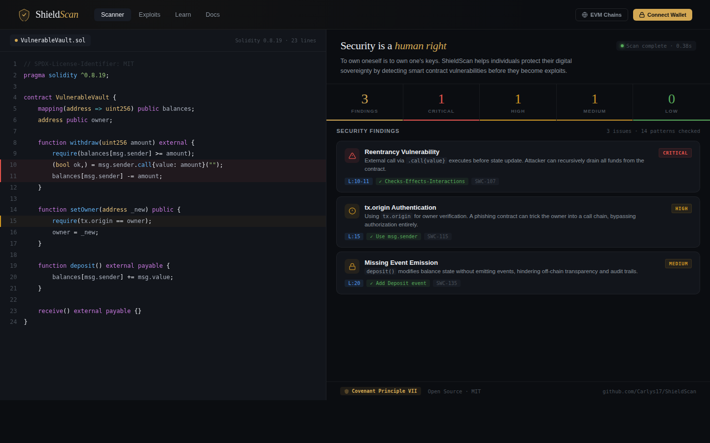

<p align="center">
  
</p>

<h1 align="center">ShieldScan</h1>

<p align="center">
  <strong>Open-source smart contract vulnerability scanner for the Web3 community.</strong>
</p>

<p align="center">
  
  
  
  
  
</p>

<p align="center">
  
</p>

---

## Overview

ShieldScan is a security-first tool that scans Solidity smart contracts for common vulnerabilities, helping developers and auditors identify critical issues before deployment. Available as both a **Python CLI tool** and an **interactive web application**.

Built with the principle that **robust security defenses belong in the hands of individuals** — not locked behind expensive audit firms.

## Features

- **14+ Vulnerability Patterns** — Reentrancy, tx.origin, unchecked calls, integer overflow, and more
- **SWC Registry Mapped** — Every finding linked to the Smart Contract Weakness Classification
- **Severity Classification** — Critical, High, Medium, Low with actionable fix recommendations
- **Multi-Format Output** — JSON, Markdown, EVMbench, and interactive HTML reports
- **EVMbench Compatible** — Benchmark against real-world vulnerabilities from Paradigm/OpenAI
- **Claude Code Integration** — MCP server + `/security-scan` skill for AI-powered semantic analysis
- **Web UI** — Paste code and scan instantly in the browser
- **CLI Tool** — Integrate into CI/CD pipelines and development workflows
- **100% Open Source** — MIT licensed, free forever

## Quick Start

### Web App (No Install)

Open `public/index.html` in your browser — paste Solidity code and scan instantly.

### Python CLI

```bash
# Clone the repository
git clone https://github.com/Carlys17/ShieldScan.git
cd ShieldScan

# Install dependencies
pip install -r requirements.txt

# Scan a contract
python src/scanner.py examples/VulnerableVault.sol

# Output as JSON
python src/scanner.py examples/VulnerableVault.sol -f json

# Output as Markdown report
python src/scanner.py examples/VulnerableVault.sol -f markdown -o report.md
```

## Vulnerability Patterns

| ID | Pattern | Severity | SWC |
|---|---|---|---|
| 01 | Reentrancy | Critical | SWC-107 |
| 02 | tx.origin Authentication | High | SWC-115 |
| 03 | Unchecked Call Return | High | SWC-104 |
| 04 | Delegatecall to Untrusted | Critical | SWC-112 |
| 05 | Unprotected selfdestruct | Critical | SWC-106 |
| 06 | Integer Overflow/Underflow | High | SWC-101 |
| 07 | Timestamp Dependence | Medium | SWC-116 |
| 08 | Block Number Dependence | Low | SWC-120 |
| 09 | Missing Access Control | Medium | SWC-105 |
| 10 | Floating Pragma | Low | SWC-103 |
| 11 | Uninitialized Storage | High | SWC-109 |
| 12 | DoS with Gas Limit | Medium | SWC-128 |
| 13 | Missing Event Emission | Medium | SWC-135 |
| 14 | Hardcoded Addresses | Low | SWC-134 |

## Project Structure

```
ShieldScan/
├── src/
│   └── scanner.py                # Core vulnerability scanner engine
├── public/
│   └── index.html                # Web app (single-file, no build needed)
├── mcp_server/
│   ├── shieldscan_server.py      # MCP server for Claude Code integration
│   └── requirements.txt          # MCP server dependencies
├── .claude/
│   ├── settings.json             # MCP server registration
│   └── skills/security-scan/
│       └── SKILL.md              # /security-scan slash command
├── benchmark/
│   ├── evmbench_adapter.py       # EVMbench format conversion & matching
│   ├── evmbench_runner.py        # Benchmark orchestration pipeline
│   ├── config.yaml               # Benchmark configuration
│   ├── requirements.txt          # Benchmark dependencies (pyyaml, requests)
│   ├── shieldscan_agent/         # ShieldScan-only EVMbench agent
│   │   ├── config.yaml
│   │   ├── start.sh
│   │   └── aggregate.py
│   └── hybrid_agent/             # ShieldScan + Claude Code hybrid agent
│       ├── config.yaml
│       ├── start.sh
│       ├── DETECT.md
│       └── aggregate_hybrid.py
├── examples/
│   ├── VulnerableVault.sol       # Example vulnerable contract
│   └── SafeVault.sol             # Example secure contract
├── docs/
│   ├── screenshot.png            # App screenshot
│   └── logo.svg                  # ShieldScan logo
├── requirements.txt
├── LICENSE
└── README.md
```

## Example Output

```
╔══════════════════════════════════════════════════════════════╗
║  ShieldScan — Smart Contract Vulnerability Scanner          ║
╚══════════════════════════════════════════════════════════════╝

 Target: VulnerableVault.sol
 Lines:  23 | Patterns: 14 | Time: 0.38s

 ┌─────────────────────────────────────────────────────────┐
 │  FINDINGS: 3 total                                      │
 │  ● Critical: 1  ● High: 1  ● Medium: 1  ○ Low: 0      │
 └─────────────────────────────────────────────────────────┘

 [CRITICAL] Reentrancy Vulnerability (SWC-107)
   Line 11-12 | msg.sender.call{value} before state update
   Fix: Apply Checks-Effects-Interactions pattern

 [HIGH] tx.origin Authentication (SWC-115)
   Line 16 | tx.origin used for authorization
   Fix: Replace with msg.sender

 [MEDIUM] Missing Event Emission (SWC-135)
   Line 21 | State change without event
   Fix: Emit Deposit event after balance update
```

## Use Cases

- **Pre-deployment audit** — Quick first-pass security scan before mainnet deployment
- **Learning tool** — Understand common smart contract vulnerabilities with real examples
- **CI/CD integration** — Automate security checks in your development pipeline
- **Bug bounty recon** — Rapid assessment of target contracts on Immunefi, Code4rena, etc.

## EVMbench Benchmark Integration

ShieldScan supports [EVMbench](https://github.com/paradigmxyz/evmbench), the Paradigm/OpenAI smart contract security benchmark with 40 real-world audits and 100+ vulnerabilities from Code4rena contests.

### EVMbench Output Format

Generate EVMbench-compatible submission files:

```bash
python src/scanner.py contract.sol -f evmbench -o submission/audit.md
```

### Running the Benchmark

Install benchmark dependencies (core scanner needs none):

```bash
pip install -r benchmark/requirements.txt
```

Run against the full EVMbench dataset:

```bash
python benchmark/evmbench_runner.py --config benchmark/config.yaml
```

Run against a specific audit:

```bash
python benchmark/evmbench_runner.py --audit-id 2023-07-pooltogether
```

Run against a local copy of the EVMbench dataset:

```bash
python benchmark/evmbench_runner.py --audits-dir /path/to/frontier-evals/project/evmbench/audits
```

Results are saved to `benchmark/results/` as `summary.json` and `summary.md`.

### Using ShieldScan as an EVMbench Agent

To register ShieldScan in the EVMbench local evaluation framework:

1. Copy `benchmark/shieldscan_agent/` to `evmbench/agents/shieldscan/`
2. Copy `src/scanner.py` into the agent directory
3. Run the EVMbench evaluation with `--agent shieldscan`

### Expected Performance

ShieldScan uses regex-based pattern matching to detect 14 vulnerability classes. EVMbench ground truth contains complex, logic-level vulnerabilities from real Code4rena audit contests. Expected results:

- **Recall**: Low (~2-8%). Most EVMbench vulnerabilities require semantic understanding beyond pattern matching.
- **Precision**: Variable. ShieldScan may flag patterns that overlap with ground truth, but many will be false positives on large codebases.
- **Strongest matches**: Reentrancy (SWC-107), access control issues (SWC-106), unchecked return values (SWC-104).
- **Weakest areas**: Business logic bugs, economic exploits, cross-contract interactions, oracle manipulation.

The benchmark is valuable as a baseline to measure improvement as ShieldScan's analysis capabilities grow.

## Claude Code Security Integration

ShieldScan integrates with [Claude Code](https://claude.com/claude-code) to combine fast regex-based scanning with AI-powered semantic analysis.

### MCP Server

Expose ShieldScan as tools callable by Claude Code via the Model Context Protocol:

```bash
# Install MCP dependencies
pip install -r mcp_server/requirements.txt

# Register with Claude Code
claude mcp add shieldscan -- python mcp_server/shieldscan_server.py
```

Available tools: `scan_file`, `scan_code`, `scan_directory`, `get_patterns`.

If you open the project in Claude Code, the MCP server is auto-registered via `.claude/settings.json`.

### /security-scan Skill

A slash command that runs ShieldScan first, then Claude performs deep semantic analysis:

```bash
# Inside Claude Code
/security-scan examples/VulnerableVault.sol
/security-scan contracts/
```

The skill combines ShieldScan's 14 regex patterns with AI analysis of business logic, cross-function data flow, economic attack vectors, and governance risks. Each finding is tagged as `[CONFIRMED]`, `[AI-DISCOVERED]`, or dismissed as false positive.

### Hybrid EVMbench Agent

A two-phase agent for EVMbench that uses ShieldScan as a fast pre-scan, then Claude Code for deep analysis:

```bash
# Copy to EVMbench
cp -r benchmark/hybrid_agent/ <evmbench>/evmbench/agents/hybrid_shieldscan/
cp src/scanner.py <evmbench>/evmbench/agents/hybrid_shieldscan/

# Run with EVMbench
# --agent hybrid_shieldscan
```

The hybrid approach provides ShieldScan findings as "hints" to Claude, pointing at potential hotspots. Claude then validates regex findings and discovers additional logic-level vulnerabilities, significantly improving both precision and recall.

## Limitations

ShieldScan is a **static pattern-matching** scanner. It is not a replacement for:

- Professional manual audits
- Symbolic execution tools (Mythril, Manticore)
- Fuzzing tools (Echidna, Foundry)
- Formal verification

Use ShieldScan as a **first line of defense**, then combine with professional tools for production contracts.

## Contributing

Contributions are welcome! You can help by:

1. Adding new vulnerability patterns
2. Improving detection accuracy
3. Submitting false positive reports
4. Improving documentation

## License

MIT License — free to use, modify, and distribute.

## Acknowledgments

- [SWC Registry](https://swcregistry.io) — Smart Contract Weakness Classification
- [OpenZeppelin](https://openzeppelin.com) — Security best practices
- [Trail of Bits](https://www.trailofbits.com) — Slither & security research
- [Paradigm](https://paradigm.xyz) — EVMbench smart contract security benchmark
- [Claude Code](https://claude.com/claude-code) — AI-powered code analysis via MCP
- [The Covenant of Humanistic Technologies](https://manifest.human.tech) — Universal Security principle

---

<p align="center">
  <strong>Built with 🛡️ for the Web3 community</strong>
  <br/>
  <sub>Security is a public good.</sub>
</p>
